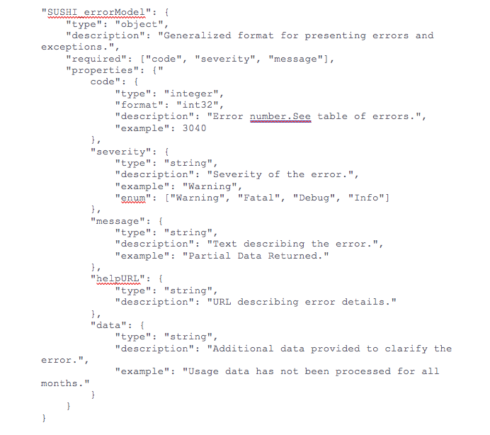

.. The COUNTER Code of Practice for Research Data © 2017-2024 by COUNTER Metrics
   is licensed under CC BY-SA 4.0. To view a copy of this license,
   visit https://creativecommons.org/licenses/by-sa/4.0/

Appendix B: Handling Errors and Exceptions
==========================================

As a rule, the structure of the SUSHI response will be governed by the SUSHI schema; therefore, any error conditions that can be reported will be specified within the SUSHI response. The following is a definition from the Research Data SUSHI API Specification that shows the format of the exception.

.. centered:: Figure B: The SUSHI error model.

As indicated in the JSON code in Figure B (above), multiple exceptions can be returned, and the exceptions have the following elements:
* code: is a numeric exception number that identifies the exception. See table 1 for values.
* severity: indicates if the exception is one of:
  * Fatal: unable to complete the transaction. The problem is with the service and may be temporary and a retry could be successful. No report is returned. Example: service busy.
  * Error: unable to complete the transaction. The problem is with the request such that a retry will not be successful unless the request or other configuration details change. No report is returned.  Example:  Requestor not authorized.
  * Warning: The transaction can be completed, but not all requested information could be returned. Examples: “Usage Not Ready for Requested Data; Partial Data Returned”
  * Debug: reserved for use by developers as a means of providing additional data about the request or response to the calling application.
* message: textual description of the exception. For exception codes > 999 the message must exactly match column 1 in table B.1.
* data: additional optional data that further describes the error. Example: for the Partial Data Returned exception, the “data” could state “You requested 2017-01-01 to 2016-12-31; however, only 2017-01-01 to 2017-06-30 were available.”
* helpurl: an optional variable that includes the URI to a help message that explains the exception in more detail.

Table B.1 (below) provides a list of possible exceptions that may occur for Research Data SUSHI API reports.

.. only:: latex

   .. tabularcolumns:: |>{\raggedright\arraybackslash}\Y{0.27}|>{\parskip=\tparskip}\Y{0.47}|>{\raggedright\arraybackslash}\Y{0.26}|

.. list-table::
   :class: longtable
   :widths: 20 20 26 54
   :header-rows: 1

   * - Exception (message)
     - Severity
     - Exception Number (code)
     - Invocation Conditions

   * - Info or Debug
     - Info, Debug
     - 0
     - Any. These messages will never be standardized, and service providers can design them as they see fit.

   * - Warnings
     - Warning
     - 1-999
     - Any. This range is reserved for the use of service providers to supply their own custom warnings.
     
   * - Service Not Available
     - Fatal
     - 1000
     - Service is executing a request, but due to internal errors cannot complete the request. Service must return ReportResponse and no payload.
     
   * - Service Busy
     - Fatal
     - 1010
     - Service is too busy to execute the incoming request. Service must return ReportResponse with this exception and no payload. Client should retry the request after some reasonable time.
     
   * - Client Has Made Too Many Requests
     - Fatal
     - 1020
     - If the server sets a limit on the number of requests a client can make within a given timeframe, the server will return this error when the client exceeds that limit. The server would provide an explanation of the limit in the Message of the error (e.g., “Client has made too many requests. This server allows only 5 requests per day per RequestorID and CustomerID.”).
     
   * - Insufficient Information to Process Request
     - Fatal
     - 1030
     - There is insufficient data in the request to begin processing (e.g., missing Requestor ID, Report is missing, no Customer ID, etc.).
     
   * - Requestor Not Authorized to Access Service
     - Error
     - 2000
     - If Requestor ID is not recognized or not authorized by the service.
     
   * - APIKey Invalid
     - Error
     - 2020
     - The service being called requires a valid APIKey to access usage data and the key provided was not valid or not authorized for the data being requested.
     
   * - Report Not Supported
     - Error
     - 3000
     - The requested report name, version, or other means of identifying a report that the service can process is not matched against the supported reports.
     
   * - Report Version Not Supported
     - Error
     - 3010
     - Requested version of the data is not supported by the service.
     
   * - Invalid Date Arguments
     - Error
     - 3020
     - Any format or logic errors involving date computations (e.g., end date cannot be less than begin date).
     
   * - No Usage Available for Requested Dates
     - Error
     - 3030
     - Service did not find any data for the date range specified.
     
   * - Usage Not Ready for Requested Dates
     - Error, Warning
     - 3031
     - Service has not yet processed the usage for one or more of the requested months, if some months are available that data should be returned. The exception should include the months not processed in the additional data element.
     
   * - Partial Data Returned
     - Warning
     - 3040
     - Request could not be fulfilled in its entirety. Data that was available was returned.
     
   * - Parameter Not Recognized in this Context
     - Warning
     - 3050
     - Request contained one or more parameters that are not recognized by the Server in the context of the report being serviced. The server should list the Name of unsupported filter in the Message element of the Exception.
       Note: The server is expected to ignore unsupported parameters and continue to process the request, returning data that is available without the parameter being applied.
     
   * - Invalid ReportFilter Value
     - Warning, Error
     - 3060
     - Request contained one or more Filter values in the ReportDefinition that are not supported by the Server. The server should list the Name of unsupported filter values in the Message element of the Exception.
       Note: The server is expected to ignore unsupported filters and continue to process the request, returning data that is available without the filter being applied.
     
   * - Incongruous ReportFilter Value
     - Warning, Error
     - 3061
     - A filter element includes multiple values in a pipe-delimited list; however, the supplied values are not all of the same scope.
     
   * - Invalid ReportAttribute Value
     - Warning, Error
     - 3062
     - Request contained one or more ReportAttribute values in the ReportDefinition that are not supported by the Server. The server should list the Name of unsupported report attribute values in the Message element of the Exception.
       Note: The server is expected to ignore unsupported report attributes and continue to process the request, returning data that is available without the report attribute being applied.
     
   * - Required ReportFilter Missing
     - Warning, Error
     - 3070
     - A required filter was not included in the request. Which filters are required will depend on the report and the service being called. In general, the omission of a required filter would be viewed as an Error; however, if the service is able to process the request using a default value then a Warning can be returned. The Message element of the Exception should name the missing filter.
     
   * - Required ReportAttribute Missing
     - Warning, Error
     - 3071
     - A required report attribute was not included in the request. In general, the omission of a required filter would be viewed as an Error; however, if the service is able to process the request using a default value, then a Warning can be returned. The Message element of the Exception should name the missing filter.
     
   * - Limit Requested Greater than Maximum Server Limit
     - Warning
     - 3080
     - The requested value for limit (number of items to return) exceeds the server limit. The server is expected to return data in the response (up to the limit). The Message element of the exception should indicate the server limit.
\*

Note 1: An Error does not interrupt completion of the transaction (in the sense of a programmatic failure), although it may not return the expected report for the reason that is identified. A Fatal exception does not complete the transaction; the problem may be temporary and a retry could be successful.

Note 2: Optional response: Service may respond with the additional exception of Info level and include additional information in the message. For example, if the client is requesting data for a date range where the begin date is before what the service offers, the service might include a HelpURL that can provide more information about supported dates.

Note 3: If multiple exceptions are discovered, each exception should be returned in its own element.

Note 4: Clarifying details about an exception (e.g., the filter that was missing or deemed invalid should be added to the Data element or Message element of the exception so that the caller knows what to correct).

Note 5: If the caller gets the baseURL, the version, or method wrong, the expectation is that they will receive an HTTP 404 error since the specified path is not valid.